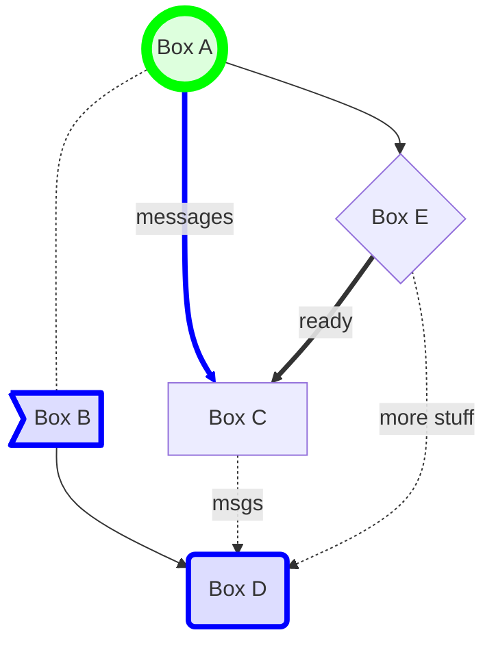

# Jeffery Brown Portfolio

This application provides a page for showcasing porfolio projects completed by Jeffery Brown.

# Technologies Used for This Portfolio Page

* JavaScript, D3

# Reference

* GitHub: https://github.com/daddyjab/Jeffery_Brown_Portfolio
* Visualization: https://daddyjab.github.io/Jeffery_Brown_Portfolio/

# Contributions

* Jeffery Brown: Designed and implemented all code for this application.

* Data:
    * The list projects, descriptions, technologies used, and key links has been manually populated in `static/js/portfolio_info.js`

# Summary

* The goal for this page is to provide users with a simple summary of key projects I have completed, technologies used, and a hint of approaches I took.
* To make ongoing maintenance of this site easier, I used JavaScript code to build the  Projects table based upon information in the `portfolio_info.js` file.  The terms in the Technologies Used list are collected as the Project table is being built, and a Set is used to ensure that the Technologies Used entries are unique.
* Each Project listed on the page has been updated with a helpful `README.md` file, including where appropriate screenshots, Jupyter notebook snippets, or other helpful content.

Enjoy!

-- Jeffery Brown

# Design
The content on the Portfolio page is rendered dynamically based upon information in a JavaScript dictionary in `portfolio_info.js`.
* D3 is used to bind the project information to the Project table on the right of the page.
* The technology terms are collected and used to create the list of technologies on the left of the page.  Additional D3 code adds on click actions to highlight the technology terms.
* Bootstrap is used to ensure good formating on both large and smaller screens

Example of Mermaid diagram:

